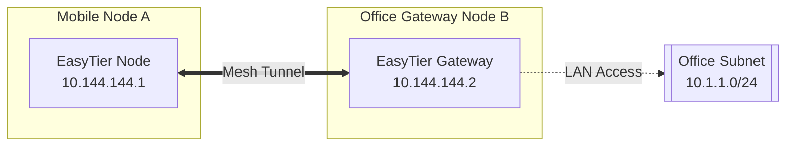

# EasyTier-Go

[](https://github.com/wx2020/easytier-go/actions/workflows/go.yml)
[](https://github.com/wx2020/easytier-go/actions/workflows/gui.yml)
[](https://github.com/wx2020/easytier-go/actions/workflows/interop.yml)
[](https://github.com/wx2020/easytier-go/actions/workflows/core.yml)
[](https://github.com/wx2020/easytier-go/blob/feature/LICENSE)

[简体中文](/README_CN.md) | [English](/README.md)

> ✨ A high-performance, simple, and secure decentralized virtual private network (Mesh VPN) powered by a clean-room Go rewrite, 100% protocol-compatible with the official EasyTier 2.6.4 specification.

<p align="center">


</p>

📚 **[Documentation](https://easytier.cn/en/)** | 🖥️ **[Web Console](https://easytier.cn/web)** | 📝 **[Releases](https://github.com/wx2020/easytier-go/releases)** | 🧩 **[System Engineering Spec](docs/GO_REWRITE_SE.md)** | 🛡️ **[Clean-Room Policy](docs/CLEAN_ROOM.md)**

---

## Highlights & Go Architecture Advantages

This repository contains the **clean-room pure Go reimplementation** of EasyTier. The upstream Rust 2.6.4 codebase serves as the compatibility oracle and specification baseline.

Key advantages of the Go rewrite:

- 🚀 **Pure Go Native Implementation**: Core binaries are built with `CGO_ENABLED=0` (pure Go), producing single, self-contained static executables with zero external dynamic library dependencies and no glibc version coupling.
- 🖥️ **Ultra-lightweight Wails Desktop Client**: Completely decoupled from Tauri and Rust (removed over 4,300 lines of Rust glue code). Replaced with a pure Go **Wails v2** desktop host that reuses 100% of the modern Vue 3 interface. Binary size is reduced from 40 MB down to **~8 MB** with sub-3-second builds.
- 🤝 **100% Bidirectional Protocol Compatibility**: Verified continuously against the official Rust 2.6.4 oracle through an automated matrix of over 60 test cells (`interop.yml`) covering TCP, UDP, WebSocket, WireGuard, Noise_xx handshakes, relaying, and compression.
- 🌍 **Focused on Mainstream Production Platforms**: Pruned obsolete or high-maintenance legacy architectures (32-bit ARMv6/v7, MIPS, RISC-V, LoongArch) to ensure production-grade performance and reliability on **x86_64** and **aarch64 (ARM64)**.
- ⚡ **Context-Bound Lifecycle Safety**: Every socket, TUN file descriptor, routing table entry, and temporary resource is bound to a `context.Context` supervisor with guaranteed teardown and rollback paths.

---

## Supported Platform Matrix

| OS | Supported Architectures | Artifact Type | Target Environment |
| :--- | :--- | :--- | :--- |
| **Linux** | `amd64 (x86_64)`, `arm64 (aarch64)` | Static binaries, Systemd service, Docker | Cloud servers, NAS, Raspberry Pi 4/5, edge gateways |
| **Windows** | `amd64 (x86_64)`, `386 (i686)` | Daemon (`.exe`), Wails lightweight GUI app | Windows 10/11 Desktop and Windows Server |
| **Android** | `arm64-v8a` | Magisk module, Android mobile core | Modern 64-bit Android smartphones and tablets |
| **FreeBSD** | `amd64 (x86_64)` | Static binaries | FreeBSD routers and gateways |

> *Note: Legacy 32-bit ARM (ARMv6/v7), MIPS, RISC-V 64, and LoongArch 64 architectures have been pruned from continuous release pipelines. For legacy embedded routers, please use historical releases or custom cross-compilation.*

---

## Core Features

### Fundamentals
- 🔒 **Decentralized Mesh Architecture**: Peer-to-peer equal nodes with automatic discovery, NAT traversal, and zero single points of failure.
- 🚀 **Easy to Use**: Unified control via CLI commands, lightweight GUI desktop client, or web management interface.
- 🔐 **Cryptographic Security**: End-to-end encryption using the Noise Protocol framework (`Noise_XX` pattern) with ChaCha20-Poly1305 / AES-GCM ciphers.

### Advanced Networking
- 🔌 **Full-Cone NAT Traversal**: High-performance UDP and IPv6 hole-punching capable of traversing complex NAT4-NAT4 environments.
- 🌐 **Subnet Proxy (Site-to-Site LAN)**: Declare local IP ranges (e.g. `10.1.1.0/24`) to connect entire office/home LAN networks without installing clients on every device.
- 🔄 **Intelligent Dynamic Routing**: Latency-optimized and loss-aware routing algorithm that switches seamlessly between direct P2P and multi-hop relays.
- ⚡ **Multi-Protocol Transports**: Encapsulation support over TCP, UDP, WebSocket (WS/WSS), and WireGuard (WG).

---

## Quick Start

### Option 1: Download Pre-Built Releases (Recommended)

Download the binary for your operating system and CPU architecture from the [Releases Page](https://github.com/wx2020/easytier-go/releases).

### Option 2: Build From Source (Pure Go, Fast)

No Rust, C++ toolchain, or Zig compiler is required. Simply install Go (>= 1.24):

```bash
# 1. Clone repository
git clone -b feature https://github.com/wx2020/easytier-go.git
cd easytier-go

# 2. Build core daemon and CLI (takes only a few seconds)
cd go
go build ./cmd/easytier-core ./cmd/easytier-cli

# 3. Run unit tests with race detection
go test -race ./...

# 4. Build Wails Desktop GUI (requires Node.js and pnpm for frontend build)
cd ../easytier-gui
pnpm install
pnpm build
cd ../go/gui
go build -ldflags "-s -w" -o easytier-gui.exe .
```

---

## Usage Guide

### 1. Fast Networking via Public Shared Nodes

When neither node has a public IP, connect through community shared nodes using matching `--network-name` and `--network-secret`:

#### Node A:
```bash
# Run with administrator / root privileges
sudo easytier-core -d --network-name mynet --network-secret mysecret -p tcp://<SharedNodeIP>:11010
```

#### Node B:
```bash
sudo easytier-core -d --network-name mynet --network-secret mysecret -p tcp://<SharedNodeIP>:11010
```

#### Verify Network Status:
```bash
easytier-cli peer
```

```text
| ipv4         | hostname       | cost  | lat_ms | loss_rate | rx_bytes | tx_bytes | tunnel_proto | nat_type | id         | version         |
| ------------ | -------------- | ----- | ------ | --------- | -------- | -------- | ------------ | -------- | ---------- | --------------- |
| 10.126.126.1 | node-a         | Local | *      | *         | *        | *        | udp          | FullCone | 439804259  | 2.6.4           |
| 10.126.126.2 | node-b         | p2p   | 3.452  | 0         | 17.33 kB | 20.42 kB | udp          | FullCone | 390879727  | 2.6.4           |
|              | PublicServer   | relay | 27.796 | 0.000     | 50.01 kB | 67.46 kB | tcp          | Unknown  | 3771642457 | 2.6.4           |
```

Test connectivity:
```bash
ping 10.126.126.2
```

---

### 2. Decentralized Peer-to-Peer Networking

If at least one node has a reachable public address or port forwarding:

#### Start Node A (Public Node):
```bash
sudo easytier-core -i 10.144.144.1
```

#### Connect Node B to Node A:
```bash
sudo easytier-core -i 10.144.144.2 -p udp://<NodeA_Public_IP>:11010
```

#### Join Node C:
Connect to any reachable existing peer in the network:
```bash
sudo easytier-core -i 10.144.144.3 -p udp://<NodeA_Public_IP>:11010
```

---

### 3. Subnet Proxy (Site-to-Site LAN)

Expose a remote LAN subnet (e.g. `10.1.1.0/24`) to all EasyTier virtual mesh peers:



#### Declare Subnet on Node B:
```bash
sudo easytier-core -i 10.144.144.2 -n 10.1.1.0/24
```
Subnet routes automatically synchronize to Node A, allowing Node A to directly communicate with devices on `10.1.1.x`.

---

### 4. WireGuard Portal Integration

Expose a WireGuard listener port on an EasyTier node, allowing mobile devices (such as iPhones) without the EasyTier client to connect seamlessly using standard WireGuard apps:

```bash
# Listen on port 11013 and assign 10.14.14.0/24 for WireGuard peers
sudo easytier-core -i 10.144.144.1 --vpn-portal wg://0.0.0.0:11013/10.14.14.0/24
```

Retrieve the client WireGuard configuration:
```bash
easytier-cli vpn-portal
```
Import the generated `.conf` or QR code into any standard WireGuard client.

---

## Developer & Clean-Room Documentation

- **Clean-Room Policy**: Detailed specifications and non-infringement constraints are documented in [docs/CLEAN_ROOM.md](docs/CLEAN_ROOM.md).
- **System Engineering Spec**: Complete protocol specs and migration tracking in [docs/GO_REWRITE_SE.md](docs/GO_REWRITE_SE.md) and [docs/GO_REWRITE_TODOLIST.md](docs/GO_REWRITE_TODOLIST.md).
- **License**: Released under the [LGPL-3.0-only](LICENSE) license. All Go source files are tagged with SPDX headers.
