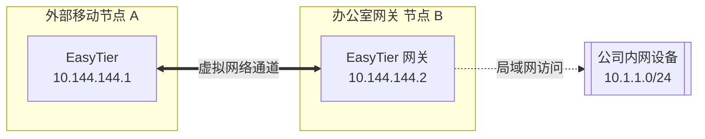

# EasyTier-Go

[](https://github.com/wx2020/easytier-go/actions/workflows/go.yml)
[](https://github.com/wx2020/easytier-go/actions/workflows/gui.yml)
[](https://github.com/wx2020/easytier-go/actions/workflows/interop.yml)
[](https://github.com/wx2020/easytier-go/actions/workflows/core.yml)
[](https://github.com/wx2020/easytier-go/blob/feature/LICENSE)

[简体中文](/README_CN.md) | [English](/README.md)

> ✨ 基于 Go 语言 Clean-Room 高性能重写的去中心化异地组网方案（Mesh VPN），100% 协议级双向兼容 EasyTier 2.6.4 官方规范。

<p align="center">


</p>

📚 **[官方文档](https://easytier.cn)** | 🖥️ **[Web 控制台](https://easytier.cn/web)** | 📝 **[下载发布版本](https://github.com/wx2020/easytier-go/releases)** | 🧩 **[架构规范](docs/GO_REWRITE_SE.md)** | 🛡️ **[Clean-Room 规范](docs/CLEAN_ROOM.md)**

---

## 项目亮点与重构优势

本项目是 EasyTier 的 **Clean-Room 纯 Go 高性能重构版本**（Rust 2.6.4 原版作为基准规范与互操作预言机）。相比原版，本项目具备以下核心优势：

- 🚀 **纯 Go 原生实现**：核心二进制采用 `CGO_ENABLED=0` 静态编译，零外部动态库依赖，不依赖特定 glibc 版本，开箱即用。
- 🖥️ **极简 Wails 桌面端**：彻底剥离了原版庞大的 Tauri + Rust 胶水层（删除 4300+ 行 Rust 冗余代码），改用纯 Go 的 **Wails v2** 桌面架构。前端复用 100% Vue 3 美观界面，客户端二进制体积从 40MB 骤降至 **~8MB**，并实现秒级极速构建。
- 🤝 **100% 双向协议兼容**：通过 CI 中跨 60 余个协议单元的自动化互通测试（`interop.yml`），无论是 TCP/UDP/WebSocket/WireGuard、Noise_xx 握手、中继转发（Relay）还是压缩传输，均与 EasyTier 2.6.4 官方节点完美互通。
- 🌍 **聚焦主流生产架构**：精简移除了维护代价极高、缺乏现代软硬件生态支持的 32 位老旧 ARM (ARMv6/ARMv7)、MIPS、RISC-V 与 LoongArch，将 100% 的精力投入在保障 **x86_64** 与 **aarch64 (ARM64)** 核心平台的极致性能与稳定性上。
- ⚡ **内存与上下文安全**：全生命周期基于 Go `context.Context` 精确控制，保证每个 Socket、TUN 网卡、系统路由与映射租约在退出时均有严密的清理与回滚路径。

---

## 平台与架构支持矩阵

| 操作系统 | 支持架构 | 交付形式 | 适用环境说明 |
| :--- | :--- | :--- | :--- |
| **Linux** | `amd64 (x86_64)`, `arm64 (aarch64)` | 静态独立二进制、Systemd 服务、Docker 容器 | 主流云服务器、NAS、树莓派 4/5 等 Linux 设备 |
| **Windows** | `amd64 (x86_64)`, `386 (i686)` | 后台守护进程 (`.exe`)、Wails 轻量 GUI 桌面客户端 | Windows 10/11 桌面与 Windows Server |
| **Android** | `arm64-v8a` | Magisk 模块、Android 核心适配层 | 现代主流 64 位 Android 手机与移动平板 |
| **FreeBSD** | `amd64 (x86_64)` | 独立二进制 | FreeBSD 服务端与网络网关 |

> *注：32 位 ARMv6/v7、MIPS、RISC-V 64、LoongArch 64 等老旧或非主流嵌入式平台已从常规 CI 构建中归档，如需在老旧路由器运行建议使用特定历史固件或自行交叉编译。*

---

## 核心特性

### 基础网络特性
- 🔒 **去中心化网状组网**：节点平等且独立，支持全自动发现、NAT 穿透与 P2P 直连，无中心化单点瓶颈。
- 🚀 **简单易用**：支持 CLI 命令行、轻量 GUI 客户端以及独立 Web 控制面板多种交互模式。
- 🔐 **严密安全性**：基于 Noise Protocol 框架（`Noise_XX` 握手模式）与 ChaCha20-Poly1305 / AES-GCM 加密通道，彻底防范中间人攻击。

### 高级网络能力
- 🔌 **全锥型 NAT 穿透**：原生支持 UDP 与 IPv6 高效打洞，能在 NAT4-NAT4 复杂内网中建立高速直连。
- 🌐 **子网代理（Site-to-Site）**：单节点一键宣告本地网段（如 `10.1.1.0/24`），实现异地局域网设备免装客户端互联互通。
- 🔄 **智能多路径路由**：基于延迟优先、丢包率感知的动态选路算法，自动在 P2P 直连与多节点中继间平滑切换。
- ⚡ **多协议传输载体**：支持 TCP、UDP、WebSocket (WS/WSS)、WireGuard (WG) 等多种底层隧道协议。
- 📊 **抗丢包优化**：内置数据压缩通道与高丢包环境流量重传优化。

---

## 快速开始

### 方式一：直接下载发布版本（推荐）

前往 [Releases 页面](https://github.com/wx2020/easytier-go/releases) 下载适合您系统架构的预编译归档包。

### 方式二：从源码编译（纯 Go 极速构建）

得益于纯 Go 重构，您无需配置 Rust、C++ 编译器或 Zig 交叉编译工具，只需安装标准 Go（>= 1.24）环境：

```bash
# 1. 克隆代码仓库
git clone -b feature https://github.com/wx2020/easytier-go.git
cd easytier-go

# 2. 编译核心守护进程与命令行工具（仅需数秒）
cd go
go build ./cmd/easytier-core ./cmd/easytier-cli

# 3. 运行本地单元测试与竞态检测
go test -race ./...

# 4. 构建轻量 Wails 桌面客户端（需 Node.js 与 pnpm 编译前端）
cd ../easytier-gui
pnpm install
pnpm build
cd ../go/gui
go build -ldflags "-s -w" -o easytier-gui.exe .
```

---

## 使用指南

### 1. 使用公共共享节点快速组网

当您没有公网 IP 时，可以使用公共共享节点快速组网。输入相同的 `--network-name` 和 `--network-secret` 作为网络标识符即可自动互联：

#### 节点 A 运行：
```bash
# Windows 请在管理员 PowerShell 中运行，Linux 请加 sudo
sudo easytier-core -d --network-name mynet --network-secret mysecret -p tcp://<公共节点IP>:11010
```

#### 节点 B 运行：
```bash
sudo easytier-core -d --network-name mynet --network-secret mysecret -p tcp://<公共节点IP>:11010
```

#### 检查网络状态：
```bash
easytier-cli peer
```

```text
| ipv4         | hostname       | cost  | lat_ms | loss_rate | rx_bytes | tx_bytes | tunnel_proto | nat_type | id         | version         |
| ------------ | -------------- | ----- | ------ | --------- | -------- | -------- | ------------ | -------- | ---------- | --------------- |
| 10.126.126.1 | node-a         | Local | *      | *         | *        | *        | udp          | FullCone | 439804259  | 2.6.4           |
| 10.126.126.2 | node-b         | p2p   | 3.452  | 0         | 17.33 kB | 20.42 kB | udp          | FullCone | 390879727  | 2.6.4           |
|              | PublicServer   | relay | 27.796 | 0.000     | 50.01 kB | 67.46 kB | tcp          | Unknown  | 3771642457 | 2.6.4           |
```

测试连通性：
```bash
ping 10.126.126.2
```

---

### 2. 去中心化点对点组网（无需中心服务器）

只要有一个节点具备公网 IP（或两者可以通过 NAT 穿透），即可组建完全自治的网络：

#### 启动公网节点（节点 A）：
```bash
sudo easytier-core -i 10.144.144.1
```
> 默认监听端口：TCP/UDP `11010`，WebSocket `11011`，WireGuard `11013`。

#### 内网节点（节点 B）连接节点 A：
```bash
sudo easytier-core -i 10.144.144.2 -p udp://<节点A公网IP>:11010
```

#### 节点 C 加入网络：
只需连接网络中任何一个已有节点（无论是节点 A 还是节点 B）：
```bash
sudo easytier-core -i 10.144.144.3 -p udp://<节点A公网IP>:11010
```

---

### 3. 子网代理（Site-to-Site LAN 互联）

假设节点 B 所在的办公内网为 `10.1.1.0/24`，节点 B 可将该子网宣告给所有 EasyTier 虚拟网成员：



#### 节点 B 宣告子网：
```bash
sudo easytier-core -i 10.144.144.2 -n 10.1.1.0/24
```
子网路由信息将自动广播并配置到节点 A 等所有对等方，此时节点 A 即可直接 `ping 10.1.1.x` 访问办公室内的任意内网服务。

---

### 4. WireGuard 客户端接入门户

EasyTier 支持开启 WireGuard 协议监听端口，使没有安装 EasyTier 的手机（如 iOS）、路由器等设备直接用系统自带的 WireGuard 客户端连接入网：

```bash
# 监听 11013 端口并为 WireGuard 客户端分配 10.14.14.0/24 子网
sudo easytier-core -i 10.144.144.1 --vpn-portal wg://0.0.0.0:11013/10.14.14.0/24
```

获取 WireGuard 客户端配置文件：
```bash
easytier-cli vpn-portal
```
将生成的配置文件或二维码导入手机 WireGuard App，即可免装额外客户端直连 EasyTier Mesh 网络。

---

## 开发者与架构说明

- **Clean-Room 净室实现**：本项目遵循严格的净室软件工程准则，实现细节请参阅 [docs/CLEAN_ROOM.md](docs/CLEAN_ROOM.md)。
- **架构设计与 ToDo 跟踪**：详细系统工程说明请阅读 [docs/GO_REWRITE_SE.md](docs/GO_REWRITE_SE.md) 及 [docs/GO_REWRITE_TODOLIST.md](docs/GO_REWRITE_TODOLIST.md)。
- **开源许可证**：本项目采用 [LGPL-3.0-only](LICENSE) 许可证发布。所有 Go 源码均标注 SPDX 版权标识。
